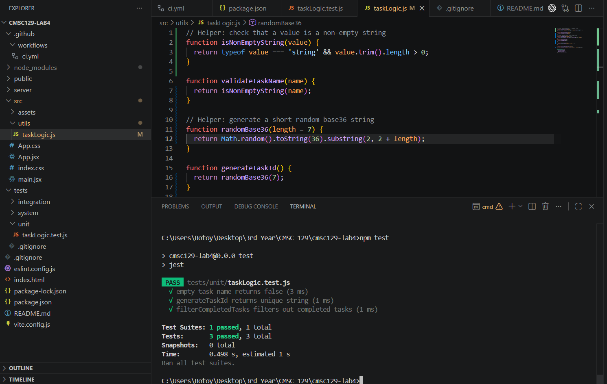

# Task Manager App

A simple Task Manager web application built using Test-Driven Development (TDD) for CMSC 129 Laboratory Assignment 4. The application allows users to create, view, and delete tasks in order to manage daily activities efficiently. The project focuses on applying the Red-Green-Refactor workflow through unit, integration, and system testing with automated CI support.

---

## User Stories

1. As a user, I want to add a task so that I can keep track of things I need to do.

2. As a user, I want to view all tasks so that I can see my pending activities.

3. As a user, I want to delete a task so that I can remove completed or unnecessary tasks.

---

## Tech Stack

### Frontend
- React

### Backend
- Node.js
- Express.js

### Testing Tools
- Jest
- React Testing Library
- Supertest
- Playwright

### CI/CD
- GitHub Actions

### Data Storage
- In-memory array storage (no database)

---

## Testing Strategy

### Unit Testing
Unit tests will focus on isolated business logic functions such as task validation and task data handling. These tests will not involve HTTP requests, browsers, or external services.

Planned unit test targets:
- Task title validation
- Empty task checking
- Task object formatting

### Integration Testing
Integration tests will verify that backend components work correctly together through real HTTP request-response cycles using Express routes and handlers.

Planned integration test targets:
- Creating a task through API requests
- Retrieving task lists through API requests

### System Testing
System tests will simulate real user interaction in a browser using Playwright. These tests will validate complete user workflows based on the defined user stories.

Planned system test targets:
- Adding a task from the UI
- Viewing created tasks
- Deleting a task from the UI

---

## Setup Instructions

### Clone the Repository

```bash
git clone <repository-url>
cd <repository-folder>
```

### Install Dependencies

```bash
npm install
```

### Run the Application

```bash
npm run dev
```

### Run Unit and Integration Tests

```bash
npm test
```

### Run System Tests

```bash
npx playwright test
```

---

## Test Results

### Unit Testing


### Integration Testing
_To be added after implementation._

### System Testing
_To be added after implementation._

---

## CI/CD Setup

GitHub Actions will be used to automatically run tests on every push to the main branch. The CI pipeline will serve as evidence of the TDD process by showing failing runs during the Red phase and passing runs during the Green phase.

Pipeline behavior:
- RED commits → failing CI
- GREEN commits → passing CI

Screenshots of CI runs will be added after implementation.